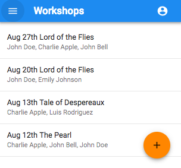

# Readers Workshop Client
[link to live app](https://reading-workshop-client.netlify.com/)
[link to server repo](https://github.com/jasontrip/reading-workshop-server)

## Summary
This is the client side app that allows a user to keep track of readers workshop sessions they have hosted and which students from their roster attended which sessions.

## Technology
React, Redux, Material-UI, Javascript, HTML, CSS

## Screenshots

View a historical list of workshops.

Edit the date, book, pages covered, a note, and add or remove students that attended.

Edit the roster of available students for the workshops.
